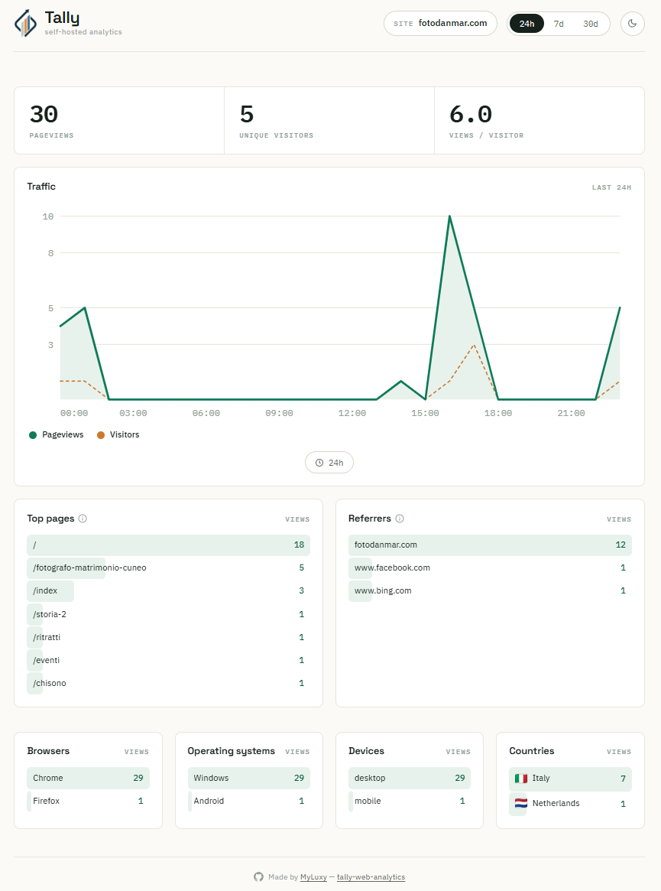

<h1 align="center">Tally Web Analytics</h1>
<p align="center">
  <a href="https://github.com/MyLuxy/tally-web-analytics/actions/workflows/ci.yml"></a>
  <a href="LICENSE"></a>
</p>

<p align="center">
  
</p>

Privacy-first, self-hosted web analytics. No cookies, no personal data, one
small script tag.

Tally is a lightweight alternative to Google Analytics that you run yourself.
The tracking script is tiny, visitors aren't followed across sites, and no IP
addresses or persistent identifiers ever hit the database.

<p align="center">
<h2 align="center">Preview</h2>
</p>

<p align="center">
  
</p>

---

<h3 align="center">Try the live demo</h3>
<p align="center">
  <a href="https://tally-analytics.duckdns.org/">
    
  </a>
</p>

## Features

- **One script tag** — around 1kb of vanilla JS, no dependencies, SPA-aware.
- **No cookies, no consent banner** — nothing that needs a GDPR pop-up.
- **Unique visitors without tracking** — a daily-rotating hash, never a stored
  identifier (see below).
- **The numbers that matter** — pageviews, unique visitors, top pages,
  referrers, and traffic over time on a hand-drawn chart.
- **Breakdowns** — browser, operating system, device and country.
- **Multi-site** — one server tracks many sites, switchable from the dashboard.
- **Optional access token** — lock the dashboard down with a single env var.
- **One process in production** — the API also serves the built dashboard.

## How the privacy works

Most analytics either bloat your page with a 40kb script that follows people
around the web, or they're so stripped down you can't answer basic questions.
Tally sits in the middle: enough to be genuinely useful, nothing that needs a
cookie banner.

**Unique visitors, without cookies.** Each event is reduced to a `visitor_hash`
of `daily_salt + site + ip + user_agent`. The salt rotates every night and is
never stored in a reversible way, so the same person looks like a brand new
visitor tomorrow. Good enough for counting, useless for tracking. (The same
approach Plausible and Fathom take.)

**Country, without an IP.** Behind Cloudflare, Vercel or Fastly, the visitor's
country is resolved at the edge and handed over as a header (`cf-ipcountry` and
friends). Tally stores only the two-letter code; it never sees or stores the IP
itself.

## Stack

- **Backend** — Node + TypeScript + Fastify
- **Storage** — SQLite (via `better-sqlite3`), kept behind a thin module so it
  can move to Postgres/Timescale later without touching the routes
- **Tracker** — around 1kb of vanilla JS, no dependencies
- **Dashboard** — React + Vite, with a hand-rolled SVG chart (no charting
  library), self-hosted fonts, and a light/dark theme. The only external asset
  is the country flag images (from flagcdn)

## Quick start

In development it's two processes: the API server and the dashboard.

```bash
# 1. API server (port 3000)
cd server
npm install
npm run dev

# 2. dashboard (port 5173), in a second terminal
cd web
npm install
npm run dev
```

Open http://localhost:5173 for the dashboard. It starts empty — drop the tracker
on a page (see below) and your first pageview shows up right away.

## Adding the tracker to a site

Drop one script tag on any page you want to measure, pointing it at your Tally
server. The tracker is served by the server itself at `/tracker.js`.

```html
<script
  defer
  data-site="my-site.com"
  src="https://your-tally-server/tracker.js"
></script>
```

- **`src`** — your Tally server's URL. Use `http://localhost:3000/tracker.js`
  while developing; in production it must be reachable over HTTPS so it loads on
  HTTPS pages.
- **`data-site`** — the name this site appears as in the dashboard. It's any
  string you choose; a new site shows up on its own with its first event, so
  there's nothing to register first.

That covers it. The tracker sends a pageview on load and on every SPA route
change, respects Do Not Track, ignores bots, and stores nothing on the visitor's
device — no cookies, no localStorage.

Custom events are a one-liner. The tracker exposes a global `tally()`:

```html
<button onclick="tally('signup')">Sign up</button>
```

If you serve the script from a different host than your server, point it at the
collector explicitly:

```html
<script
  defer
  data-site="my-site.com"
  data-endpoint="https://your-tally-server/api/collect"
  src="https://some-cdn/tracker.js"
></script>
```

## Production

In production there's just one process. Vite builds the dashboard into
`server/web-dist` and Fastify serves it from the same port as the API, with a
SPA fallback so client-side routes resolve.

```bash
cd server
npm run build:web   # builds the dashboard into server/web-dist
npm run build       # compile the server
npm start           # serves API + dashboard on port 3000
```

### Protecting the dashboard

By default the read API is open, which is what you want while running locally. Set
`TALLY_TOKEN` and the stats endpoints (`/api/stats`, `/api/sites`) require an
`Authorization: Bearer <token>` header. The dashboard prompts for the token and
remembers it. The `/api/collect` endpoint always stays open, since the tracker
has to be able to post from any site.

```bash
TALLY_TOKEN=a-long-random-string npm start
```

### Self-hosting with Docker

There's a `Dockerfile` and a `docker-compose.yml`. Tally can sit behind a web
server you already run (nginx/apache + certbot), or bring up the bundled Caddy
for automatic HTTPS on a fresh box. The full walkthrough — including a free HTTPS
hostname with no domain to buy — is in [docs/DEPLOY.md](docs/DEPLOY.md).

## Layout

```
server/         ingest + stats API, serves the tracker script
  src/
    routes/     collect (write) and stats (read)
    db.ts       schema + connection
    privacy.ts  visitor hashing, daily salt, UA parsing, DNT
    auth.ts     optional bearer-token guard for the read API
  public/       tracker.js — the script sites embed
web/            React dashboard (Vite)
  src/
    api.ts      typed client for /api/stats
    components/ Chart, StatList, TallyMarks
```

## License

[GNU AGPLv3](LICENSE). You're free to use, modify and self-host Tally, but if you
run a modified version — including as a hosted service over a network — you have
to make your source available under the same license.
