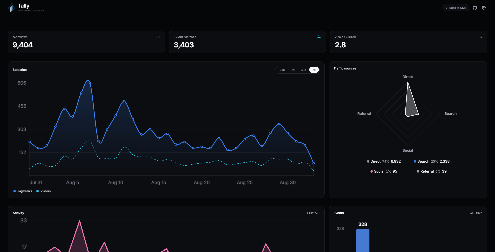

<h1 align="center">Tally Web Analytics</h1>
<p align="center">
  <a href="https://github.com/MyLuxy/tally-web-analytics/actions/workflows/ci.yml"></a>
  <a href="LICENSE"></a>
</p>

<p align="center">
  
</p>

Privacy-first, self-hosted web analytics. No cookies, no personal data, one
small script tag.

Tally is a lightweight alternative to Google Analytics that you run yourself.
The tracking script is tiny, visitors aren't followed across sites, and no IP
addresses or persistent identifiers ever hit the database.

<p align="center">
<h2 align="center">Preview</h2>
</p>

<p align="center">
  
</p>

---

<h3 align="center">Try the live demo</h3>
<p align="center">
  <a href="https://tally-analytics.duckdns.org/">
    
  </a>
</p>

## Features

- One script tag, about 1kb of vanilla JS with no dependencies, SPA-aware out of the box.
- No cookies, so no consent banner to bolt on.
- Unique visitors without tracking anyone: a hash that rotates every day, not a stored identifier (details below).
- Pageviews, unique visitors, top pages and referrers, plus a traffic chart and breakdowns by browser, OS, device and country. Any panel can expand to its full list, not just the top 10.
- One server can run multiple sites at once, switchable from the dashboard.
- Lock the dashboard down with a single access-token env var if you want to.
- Ships as one process in production, and can sit at the root of its own domain or behind a reverse proxy on a sub-path.

## How the privacy works

Most analytics tools either bloat your page with a script that follows people around the web, or strip things down so far you can't answer basic questions. Tally tries to land in between: useful enough to actually check, without needing a cookie banner.

**Unique visitors, without cookies.** Each event gets reduced to a `visitor_hash` built from `daily_salt + site + ip + user_agent`. The salt rotates every night and is never stored in a way that can be reversed, so the same person looks like a new visitor the next day. It's enough to count people, not enough to track them — the same approach Plausible and Fathom use.

**Country, without an IP.** Behind Cloudflare, Vercel or Fastly, the visitor's country gets resolved at the edge and passed along as a header (`cf-ipcountry` and its equivalents). Tally only stores the two-letter code. It never sees the IP address in the first place.

**The numbers run a little low, and that's fine.** Tally is a client-side script, so anyone blocking it doesn't get counted: ad/tracker blockers like uBlock Origin, browsers with tracking protection turned up, people sending Do Not Track or Global Privacy Control, anyone with JavaScript off. Tally respects those signals instead of working around them, so treat the totals as an honest floor rather than an exact headcount. Every in-page analytics tool has this same blind spot; the only real fix is server-side logging, which solves a different problem.

## Stack

Backend is Node, TypeScript and Fastify, with SQLite (`better-sqlite3`) behind a thin storage module so it could move to Postgres later without touching the routes. The tracker is the same ~1kb of vanilla JS mentioned above. The dashboard is React and Vite, with a hand-rolled SVG chart instead of a charting library, self-hosted fonts, and a light/dark theme. The only thing it pulls in from elsewhere is the country flag images, from flagcdn.

## Quick start

In development it's two processes: the API server and the dashboard.

```bash
# 1. API server (port 3000)
cd server
npm install
npm run dev

# 2. dashboard (port 5173), in a second terminal
cd web
npm install
npm run dev
```

Open http://localhost:5173 for the dashboard. It starts empty — drop the tracker on a page (see below) and your first pageview shows up right away.

## Adding the tracker to a site

Drop one script tag on any page you want to measure, pointing it at your Tally server. The tracker is served by the server itself at `/tracker.js`.

```html
<script
  defer
  data-site="my-site.com"
  src="https://your-tally-server/tracker.js"
></script>
```

- **`src`** points at your Tally server. Use `http://localhost:3000/tracker.js` locally; in production it needs to be reachable over HTTPS so it loads on HTTPS pages.
- **`data-site`** is whatever name you want this site to show up as in the dashboard. Pick any string and it appears on its own with the first event — nothing to register ahead of time.

> **`localhost` won't work in production, even if your site is public.** The tracker runs in each *visitor's* browser, so the URL has to be reachable from the outside — `localhost` and `192.168.x.x` point at the visitor's own machine, not at yours, and no events ever arrive. `localhost` is only for local development. The simplest setup: run Tally on the same box as your site, on a subdomain like `analytics.your-site.com` over HTTPS, and lock the dashboard with `TALLY_TOKEN` (see below) so `/api/collect` stays open to visitors while the stats stay private to you.

That covers it. The tracker fires a pageview on load and on every SPA route change, respects Do Not Track, ignores bots, and leaves nothing behind on the visitor's device: no cookies, no localStorage.

Custom events are a one-liner. The tracker exposes a global `tally()`:

```html
<button onclick="tally('signup')">Sign up</button>
```

If the script is served from a different host than your API, e.g. a CDN, point `data-endpoint` at the collector directly:

```html
<script
  defer
  data-site="my-site.com"
  data-endpoint="https://your-tally-server/api/collect"
  src="https://some-cdn/tracker.js"
></script>
```

## Production

In production there's just one process. Vite builds the dashboard into `server/web-dist` and Fastify serves it from the same port as the API, with a SPA fallback so client-side routes resolve.

```bash
cd server
npm run build:web   # builds the dashboard into server/web-dist
npm run build       # compile the server
npm start           # serves API + dashboard on port 3000
```

### Protecting the dashboard

By default the read API is open, which is what you want while running locally. Set `TALLY_TOKEN` and the stats endpoints (`/api/stats`, `/api/sites`) require an `Authorization: Bearer <token>` header. The dashboard prompts for the token and remembers it. The `/api/collect` endpoint always stays open, since the tracker has to be able to post from any site.

```bash
TALLY_TOKEN=a-long-random-string npm start
```

The collect endpoint stays open, but it's rate-limited per IP so nobody can flood it: 120 requests a minute by default. Tune it with `TALLY_RATE_MAX` and `TALLY_RATE_WINDOW` if a lot of your traffic shares one IP.

### Running under a sub-path

By default Tally expects to live at the root of its own domain. If you'd rather mount it under a path on a domain you already use, like `yoursite.com/analytics/`, set `TALLY_BASE_PATH` on the server and build the dashboard with a matching `base`:

```bash
TALLY_BASE_PATH=/analytics npm start        # server
VITE_BASE=/analytics/ npm run build         # dashboard (web/)
```

Both are empty by default, so a standard subdomain deployment needs neither. Whatever reverse proxy sits in front should forward the path through as-is, not strip it.

### Self-hosting with Docker

There's a `Dockerfile` and a `docker-compose.yml`. Tally can sit behind a web server you already run (nginx/apache + certbot), or bring up the bundled Caddy for automatic HTTPS on a fresh box. The full walkthrough, including a free HTTPS hostname with no domain to buy, is in [docs/DEPLOY.md](docs/DEPLOY.md).

## Layout

```
server/         ingest + stats API, serves the tracker script
  src/
    routes/     collect (write) and stats (read)
    db.ts       schema + connection
    privacy.ts  visitor hashing, daily salt, UA parsing, DNT
    auth.ts     optional bearer-token guard for the read API
  public/       tracker.js — the script sites embed
web/            React dashboard (Vite)
  src/
    api.ts      typed client for /api/stats
    components/ Chart, StatList, TallyMarks
```

## License

[GNU AGPLv3](LICENSE). You're free to use, modify and self-host Tally, but if you
run a modified version — including as a hosted service over a network — you have
to make your source available under the same license.
